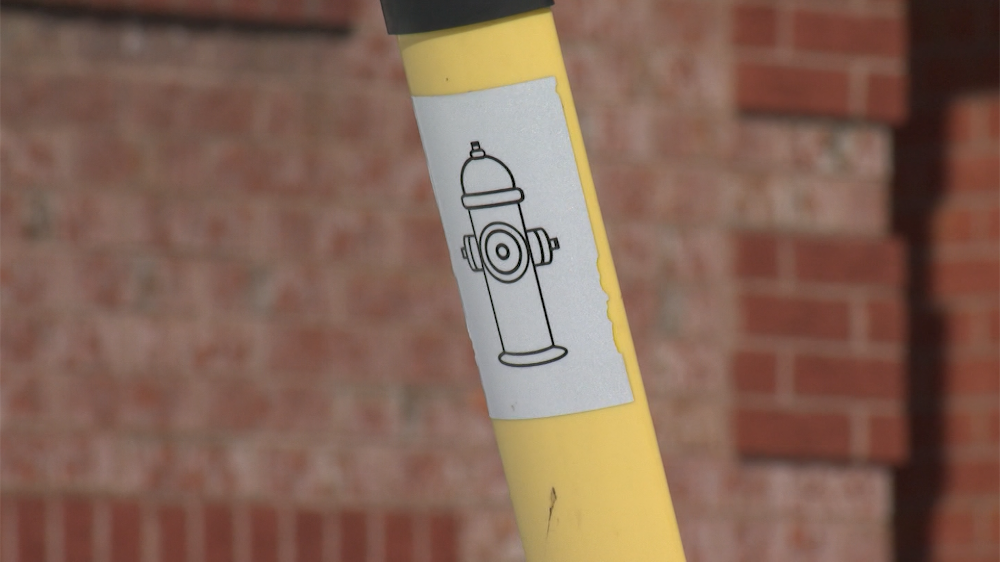
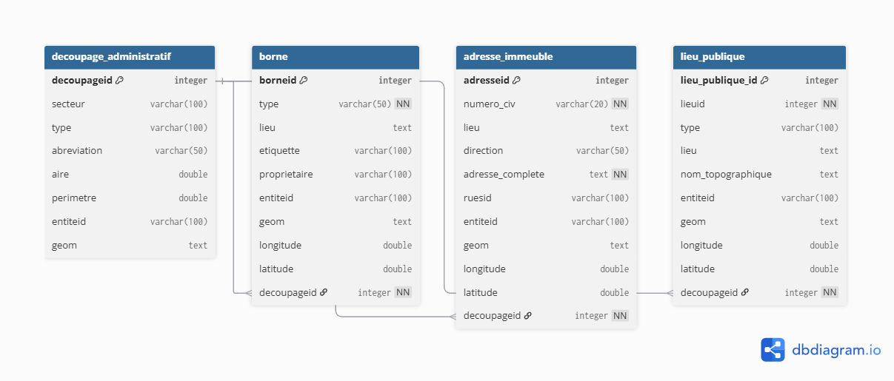
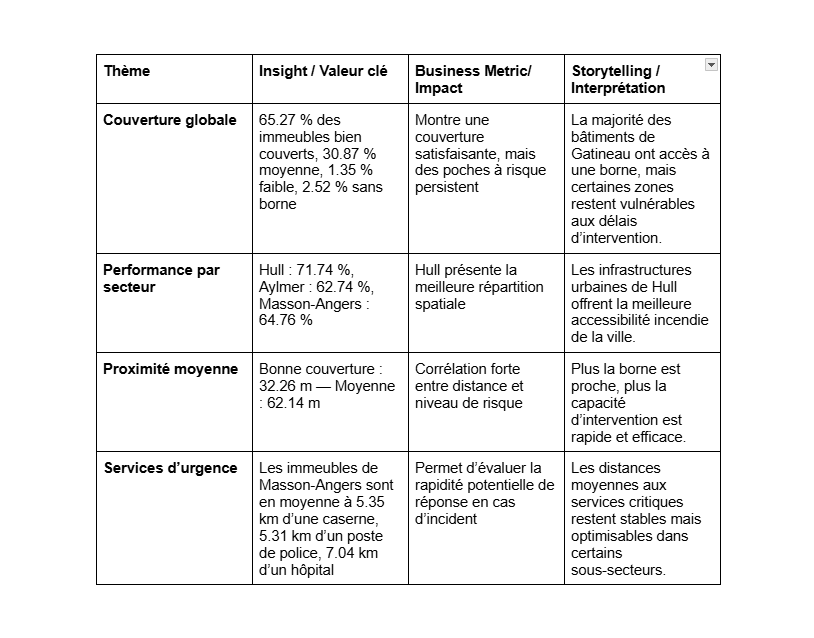
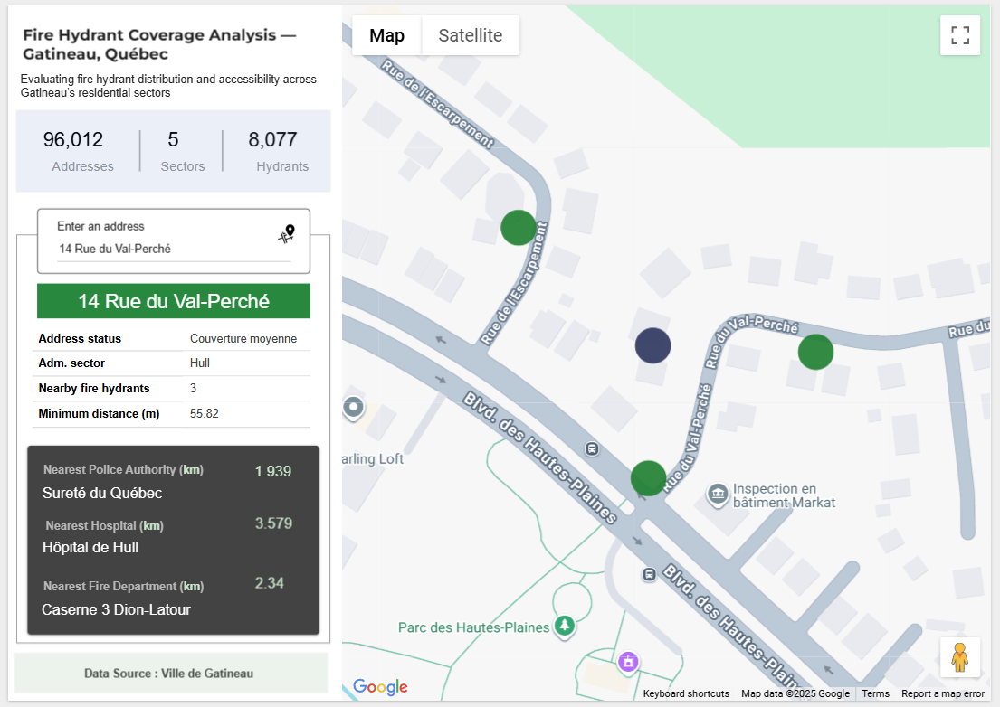
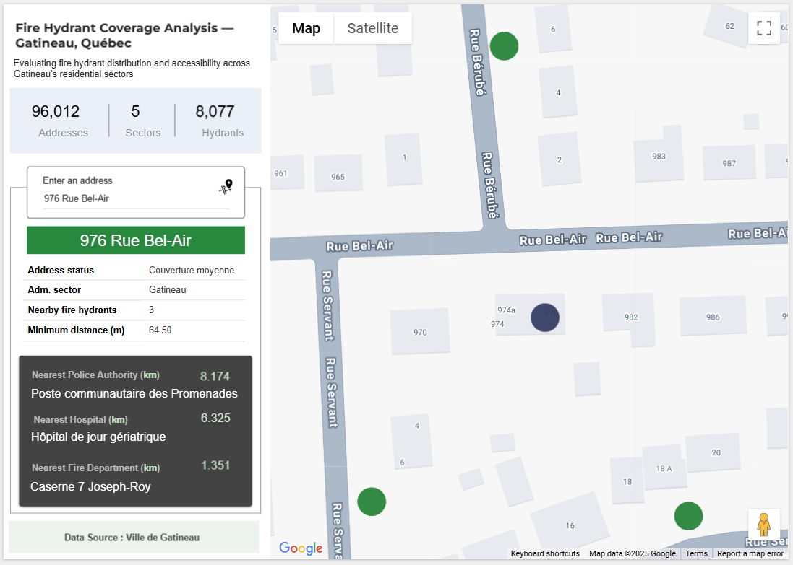

 

# Fire Hydrant Coverage Analysis — Gatineau, Québec

Projet d'analyse de données géospatiales visant à évaluer l'accessibilité des bornes d'incendie dans les zones résidentielles de Gatineau afin d'améliorer les interventions d'urgence et la planification de la sécurité urbaine.

📊 Overview of Findings

L’analyse géospatiale des bornes d’incendie à Gatineau révèle que 65.27 % des immeubles résidentiels bénéficient d’une bonne couverture, contre 30.87 % à couverture moyenne, 1.35 % à couverture faible, et 2.52 % sans borne à proximité.
Le secteur de Hull affiche la meilleure performance (71.74 % d’adresses bien couvertes) et seulement 0.20 % à faible couverture, tandis que Masson-Angers et Aylmer présentent respectivement 64.76 % et 62.74 %.
Les immeubles bien couverts se situent en moyenne à 32.26 m d’une borne, contre 62.14 m pour ceux à couverture moyenne — une performance solide, mais avec des zones ciblées d’amélioration identifiées pour renforcer la résilience urbaine.

## 🧭 1. Project Background

Cet été, un incendie particulièrement ravageur s’est déclaré à la limite de Masson-Angers, emportant 3 maisons.
Cet événement m'a fait réfléchir et a soulevé une question essentielle : La répartition des bornes d’incendie à Gatineau répond-elle efficacement aux besoins réels des pompiers et des citoyens ?

Je me suis penché sur les données ouvertes de la Ville de Gatineau et j’ai entrepris un projet d’analyse visant à explorer la relation spatiale entre les bornes d’incendie, les immeubles résidentiels et les services d’urgence, afin de :
Mesurer la proximité réelle entre bâtiments et bornes,

Identifier les zones sous-desservies,

et fournir des recommandations opérationnelles fondées sur les données ouvertes de la Ville de Gatineau.

## 🌍 2. Overview

Le projet repose sur une analyse géospatiale croisant les adresses d’immeubles résidentiels et les bornes d’incendie pour évaluer la qualité de couverture à travers la ville.

Couverture - Distance à la borne - Statut

🟢 Bonne couverture	 < 50 m	- Conforme
🟡 Couverture moyenne	50–100 m - Acceptable
🔴 Faible couverture	> 100 m -	À améliorer
⚫ Aucune borne: 	Aucune dans un rayon de 150 m	Prioritaire

Pour visualiser le rapport, veillez accéder au dossier dashboard 👉  [Voir le fichier](https://github.com/metsworks/fire_hydrant_gatineau/blob/main/dashboard/looker_report.txt)

## 🧩 3. Data Structure
Données principales

borne → bornes d’incendie 
Contient la géolocalisation et les métadonnées des bornes (type, propriétaire, étiquette, coordonnées).
Sert de base pour mesurer la proximité avec les immeubles résidentiels.

adresse_immeuble → adresses d’immeubles résidentiels géolocalisées
Regroupe les informations civiques et géographiques de chaque immeuble résidentiel de Gatineau.
Table centrale pour l’analyse de couverture.

lieu_publique → infrastructures publiques (écoles, hôpitaux, casernes, postes de police)
Sert à l’analyse de proximité secondaire, mesurant la cohérence urbaine entre habitations et services essentiels.

decoupage_administratif → structure géographique officielle de la Ville de Gatineau
Définit les secteurs et sous-secteurs (Hull, Aylmer, Masson-Angers, etc.) pour agréger les résultats par zone.

📎 Le diagramme complet des relations (ERD) est disponible dans 

.
Ce schéma illustre la structure logique du modèle et le flux de données utilisé pour générer les indicateurs de couverture.

## 📈 4. Executive Summary — Key Insights

Un exemple de certaines informations clés sont dans ce tableau

📎 

Images du rapport:    

## 🧠 5. Recommendations

Cibler les adresses à faible couverture pour une installation prioritaire de bornes.

1. Prioriser les zones à faible couverture pour de nouvelles installations

Justification : 40 adresses à Hull présentent une faible couverture (0,20 % du total).

Action : Réaliser une vérification terrain et planifier l’installation de nouvelles bornes ou l’extension du réseau existant.

Impact attendu : Améliorer la couverture de Hull jusqu’à près de 100 %, garantissant un accès équitable à l’eau d’incendie pour tous les immeubles.

2. Mieux comprendre la relation entre densité et accessibilité

La répartition des bornes semble varier selon les quartiers. Une analyse complémentaire pourrait évaluer dans quelle mesure la densité d’immeubles influence la distance moyenne à une borne.
Cela permettrait d’orienter les futurs ajustements en fonction de la structure urbaine réelle de Gatineau.

3. Mettre en relation la couverture et la proximité des services d’urgence

Les distances moyennes aux casernes, postes de police et hôpitaux donnent déjà une bonne idée de la capacité de réponse.
En reliant ces données à la couverture par borne, on pourrait identifier les secteurs cumulant éloignement et faible densité, pour mieux prioriser les interventions.

4. Approfondir l’analyse spatiale par sous-secteur

Les écarts observés entre Hull, Aylmer et Masson-Angers méritent une étude plus fine.
Segmenter davantage pourrait révéler des micro-zones où la couverture pourrait être renforcée.
Cela aiderait à bâtir une carte plus granulaire de la performance incendie.

5. Intégrer des données contextuelles pour renforcer l’analyse

Pour donner plus de profondeur à l’étude, on pourrait croiser la couverture avec :

les zones à forte densité résidentielle,

les axes routiers majeurs,

ou encore les incidents historiques d’incendie (si disponibles).
Cela permettrait de mieux relier la couverture technique à la réalité du terrain.

## ⚙️ 6. Tech Stack
Pandas – Data wrangling and ETL (Anaconda, Jupyter Notebook)
PostgreSQL / pgAdmin – Data warehouse, spatial analysis (ST_DWithin, ST_Distance)
Looker Studio – Visualisation
Git, GitHub - Versionning

